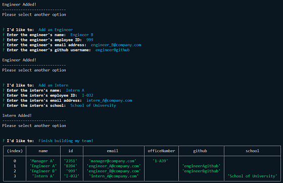
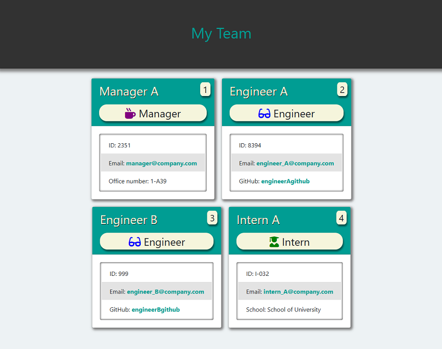

# team-profile-generator 

## Description

This is a Node.js command-line application that takes in information about employees on a software engineering team, then generates an HTML webpage that displays summaries for each person.

## Table of Contents

- [Installation](#installation)
- [Usage](#usage)
- [License](#license)
- [Tests](#tests)
- [Questions](#questions)

## Installation

To install, clone files from the root github directory.  Initialize `npm` then run `npm install inquirer` and `npm install fs` in the project directory to install required dependencies.

## Usage

To use, ensure you have node installed and type `node index.js` in the terminal.  Follow on-screen instructions to define your team and receive a custom generated html file!

### Sample Console Output

### Sample index.html Output

## License

MIT License - Please refer to the LICENSE in the repo.

## Tests

Tests are included in the `/test` directory and test 17 cases across 4 test suites.

## Questions

You can view my Github @ https://www.github.com/maximusDecimalusMeridius  
OR  
Email me with questions @ [andygg_dev@yahoo.com](mailto:andygg_dev@yahoo.com?subject=Question%20About%20team-profile-generator%20App)
    